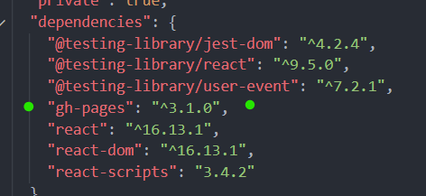
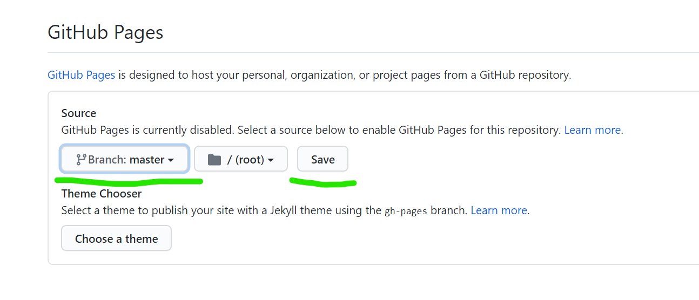
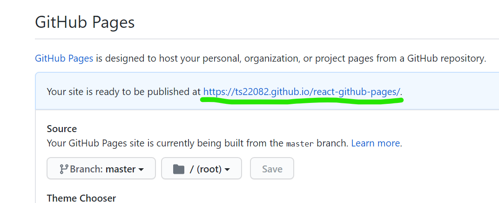
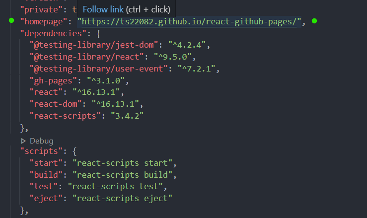
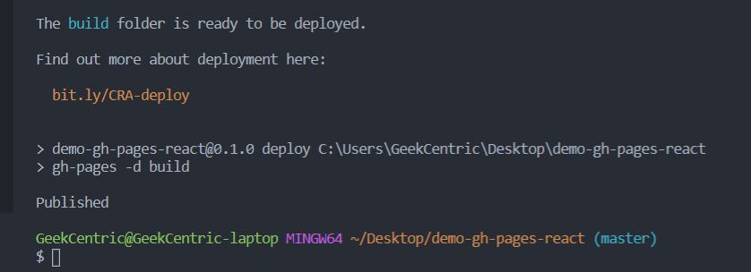
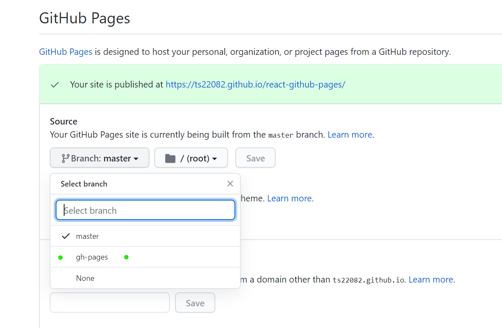

# Deploying a React App to Github Pages

- Navigate to the root folder of the project
- Install the gh-pages package from npm

`npm install gh-pages`

If you arent sure if the package was installed check the package.json file for "Dependencies"



## Add to Github

```
git init
git add *
git commit -m "first commit"
git remote add origin https://github.com/<user_name>/<repo_name>.git
git push -u origin master

```

## Set up Github Pages

- Navigate to setting on the repo page



- Navigate to github pages and for branch select "master", then click save.


- The page will reload

## Set up package.json

- Copy the github pages link



- Navigate to package.json and just above "dependecies" add:

`"homepage" : "https://<username>.github.io/<repo_name>/"`



- add 2 new scripts to the "scripts" section in package.json

```
    "predeploy": "npm run build",
    "deploy": "gh-pages -d build"
```


## Deploying

- Push everything to github

```
git add *
git commit -m "deploy"
git push
```

- Then run the deploy script

`npm run deploy`



- Navigate to the code repo on github, get into the settings then find the "Github pages Section"
- Now for branch options you have the choice of using `gh-pages` select that then click "Save"



## You are deployed!

- If you follow the github pages link and its still showing your readme just wait a minute.
